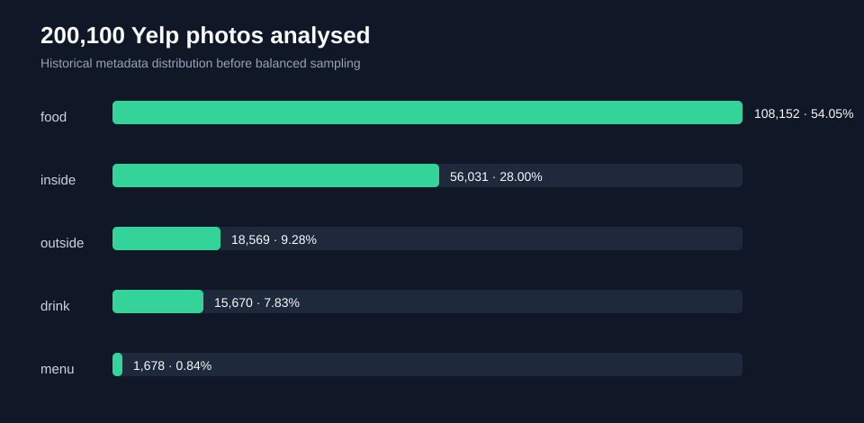

# Multimodal Restaurant Insights

An offline, privacy-conscious pipeline for exploring restaurant review text and image metadata without requiring Yelp API credentials.

## Portfolio story

The project combines two modalities often encountered in product analytics:

- review text: normalization, simple sentiment evidence and aggregate trends;
- images: safe metadata and quality features such as dimensions, aspect ratio and brightness.

It is designed for the Yelp Open Dataset or fully synthetic examples. The public repository performs no authenticated API call.

## Quick start

```bash
python -m venv .venv
pip install -e .[dev]
pytest
jupyter lab notebooks/restaurant_insights.ipynb
```

## Case-study gallery

The historical branches contained separate acquisition, text, image and dashboard experiments. They are represented here as concise, safe studies:

| Study | Main question | Portfolio value |
|---|---|---|
| [01 — Data contract](notebooks/01_data_contract.ipynb) | How can platform data be ingested without coupling analysis to credentials? | schemas, validation, privacy boundaries |
| [02 — Review text](notebooks/02_review_text.ipynb) | Which recurring themes and sentiment signals appear in reviews? | NLP preprocessing, interpretable features |
| [03 — Image quality](notebooks/03_image_quality.ipynb) | Which visual metadata can support content analysis? | image features, quality checks, responsible use |
| [04 — Multimodal synthesis](notebooks/04_multimodal_synthesis.ipynb) | How can text and image evidence be combined? | entity-level joins, aggregation, product storytelling |
| [End-to-end demo](notebooks/restaurant_insights.ipynb) | How does the complete offline workflow run? | reproducible synthetic example |
| [Historical research results](notebooks/05_historical_research.ipynb) | What was actually analysed in the original project? | corpus scale, LDA search, computer-vision pipeline |

The gallery consolidates the useful work from `master`, `dev` and `main`. Raw notebooks, API modules, cached resources and credentials are intentionally excluded.

## Historical research evidence

The original executed notebooks demonstrate substantially more than the offline demo:

- **200,100 image records**, covering 36,680 businesses and five classes;
- class distribution: 108,152 food, 56,031 inside, 18,569 outside, 15,670 drink and 1,678 menu images;
- a balanced working sample of **1,000 images** (200 per class), split into 800 training and 200 test images;
- SIFT descriptors, a VGG16 transfer-learning pipeline, PCA, t-SNE, MiniBatchKMeans and adjusted Rand evaluation;
- **1,680 LDA configurations** evaluated over topic count, alpha, beta and corpus fraction;
- best recorded LDA configuration: **22 topics**, alpha **0.61**, beta **0.01**, coherence **0.5572**.



See the [complete notebook inventory](docs/experiment_inventory.md) for provenance and limitations. These figures are preserved historical outputs; the public demo remains offline and credential-free.

## Security design

- no API key, token or authentication module;
- `.env` and raw data are ignored;
- examples are synthetic;
- network access is outside the analysis package;
- the compromised historical repository is never imported.

## Responsible use

Review sentiment is subjective and can vary by language and culture. Image analysis must respect licensing, privacy and platform terms. Results are exploratory, not automated moderation decisions.

## License

Code is released under the [MIT License](LICENSE). Yelp datasets and media remain governed by their own terms.

